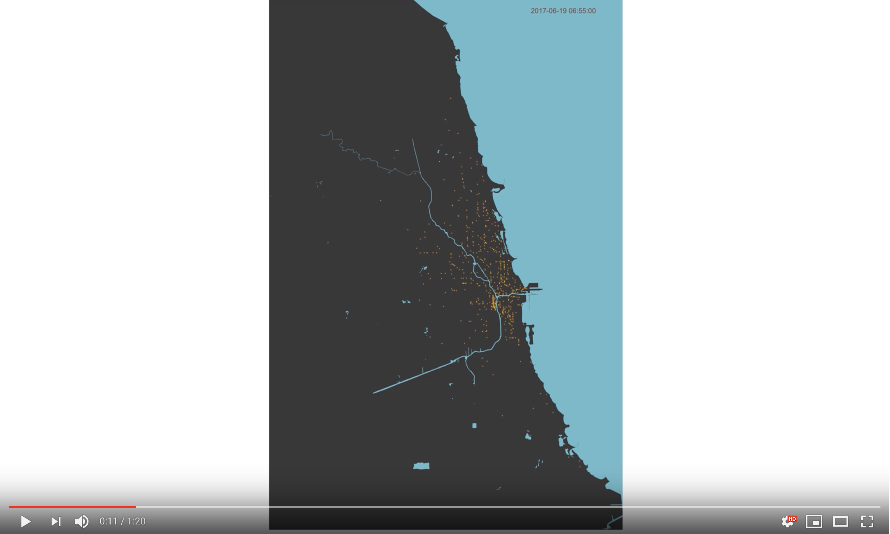

# chicago-bike-movements
An animation of the movement of Divvy bikes throughout Chicago on June 19th, 2017

A visualization of the movement of Divvy bikes throughout Chicago over the course of a day (June 19th, 2017). The visualization is based on public data and leverages OSRM, Python, R, and ffmpeg.

## Inspiration
Inspiration for this visualization came from multiple sources. I have long been interested in geospatial data and maps (check out my previous project). After looking at different examples of map-based visualizations online, I found an [excellent collection of maps](http://flowingdata.com/2014/07/30/explorations-of-people-movements-from-groups-to-the-individual/) compiled by Nathan Yao. From a visual perspective, many of these maps have an interesting combination of rigid structure and randomness. Many of these maps also don’t include any sort of basemap or background – the movements themselves ‘draw’ the road network enough that it is recognizable. I also stumbled upon a [beautiful visualization](http://spatialanalysis.co.uk/2012/02/great-maps-ggplot2/) made by James Cheshire of London cycle hire journeys. From interning in Chicago with West Monroe Partners over the 2017 summer, I knew that the Divvy bike system releases all of their trip data publicly. The temporal element of this data is something that I felt like wasn’t very well communicated by existing visualizations. By animating the map similar to a time-lapse video, I figured that it would give a better sense of movement and would communicate information about time-of-day also.

## How I did it

### Getting the data
All of the data used in this project is publicly accessible from [Divvy Bikes](https://www.divvybikes.com/system-data). Interestingly enough, the North American Bikeshare Association has developed a ‘General Bikeshare Feed Specification’ to standardize streaming bike availability data. While the data used in this project isn’t live, because of the standardization of bikeshare data, it would not be difficult to substitute the Chicago data with another city (Nice Ride in Minneapolis or Citi Bike in NYC, for example).

The data is divided into 2 CSV files: Divvy_Stations and Divvy_Trips. The Divvy_Trips dataset contains 4 relevant columns- Trip Start Time, Trip Start Station Number, Trip End Time, and Trip End Station Number. The Divvy_Stations dataset contains details for each Station, including latitude and longitude. Because I’m interested in plotting these trips on a map, I needed to lookup the latitude and longitude for each station. 

### Calculating the routes
Once I had lat/lon coordinates for the start and end of each trip, I needed to find the most logical route that a bike would take between these two points. It’s a significant assumption that the route of each ride was along the most direct route, but for the purposes of this visualization I don’t think it is too drastic. I need to do this because the Divvy system does not have GPS units embedded within the bikes, and thus there is no information on the route that the bike actually traveled.

I originally planned on using the Google Maps Directions API to determine the likely route between the start and end points, but it is rate-limited to 2,500 requests per day. With 15,692 trips on June 19th (the day I decided to visualize first, because it is a ‘typical’ weekday) alone, this wasn’t going to work. As an alternative, I used the [Open Source Routing Machine](http://project-osrm.org/), which allowed me to run a local routing engine and avoid rate limits.

### Figuring out where each bike was at every minute
Using OSRM allowed me to find the most likely route for each bike trip. The next step was to use this data to generate minute-by-minute data on bike locations. For each bike trip, I figured out the trip time (end_time-start_time) and the distance, to determine the average speed of the trip. I then used the route outputted by OSRM to figure out where the bike would have been for every minute of the journey, assuming constant speed and the most logical route. I then saved this data to a CSV file with columns for timestamp, latitude, and longitude. This was all done by *get_routes.py()*

### Creating frames
With temporal data on bike locations, the next step was to put these locations onto a map. I used ggplot in R to create an image for every minute of the day, consisting of a yellow dot for the location of each bike:

This ended up creating 1202 frames.

### Animating the frames together
The next step was to animate the 1202 frames in jpg format. I used [ffmpeg](https://www.ffmpeg.org/) to stitch these frames together. ffmpeg has a feature that is meant to create time-lapse videos based on many images, and this allowed me to create a video with a simple terminal command:

`ffmpeg -r 15 -start_number 1 -i %d.jpg -s 1920x1080 -vcodec libx264 chicago_bikes1.mp4`

